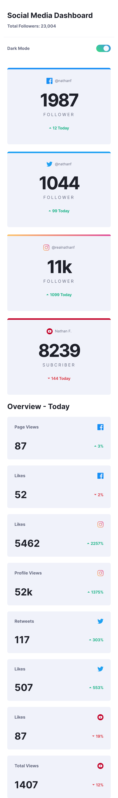
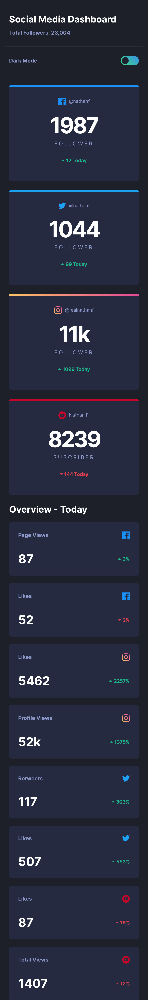

# Frontend Mentor - Social media dashboard with theme switcher solution

This is a solution to the [Social media dashboard with theme switcher challenge on Frontend Mentor](https://www.frontendmentor.io/challenges/social-media-dashboard-with-theme-switcher-6oY8ozp_H). Frontend Mentor challenges help you improve your coding skills by building realistic projects.

## Table of contents

- [Overview](#overview)
  - [The challenge](#the-challenge)
  - [Screenshot](#screenshot)
  - [Links](#links)
- [My process](#my-process)
  - [Built with](#built-with)
  - [What I learned](#what-i-learned)
  - [Continued development](#continued-development)
  - [Useful resources](#useful-resources)
- [Author](#author)
- [Acknowledgments](#acknowledgments)

**Note: Delete this note and update the table of contents based on what sections you keep.**

## Overview

### The challenge

Users should be able to:

- View the optimal layout for the site depending on their device's screen size
- See hover states for all interactive elements on the page
- Toggle color theme to their preference

### Screenshot





### Links

- Solution URL: [Click here](https://github.com/Antonio0402/social-media-dashboard-with-theme-switcher)
- Live Site URL: [Click here](https://social-media-dashboard-reactbootstrap.netlify.app/)

## My process

### Built with

- Semantic HTML5 markup
- CSS custom properties
- Bootstrap utilites class first approach
- Bootstrap custom classes and utilities modification
- Generating utilities classes by SASS mixins and variables
- Mobile-first workflow
- [React](https://reactjs.org/) - JS library
- [React Bootstrap](https://react-bootstrap.github.io/) - For styles

### What I learned

- Building a webpage from scratch using Bootstrap custom properties and mixins base on the SASS Bootstrap 5 Library;
- How to use SASS functions and mixins to generate utility classes as well as well as enable or modify the utilities.
- Modify and enable the state or responsiveness throught out the app by Bootstraps 5 's API
- Integrating the pre-made components with custom props in order to customize the appearance base on color mode

To see how you can add code snippets, see below:

```html
<h1>Some HTML code I'm proud of</h1>
```

```scss
/* Dark mode */
@include color-mode(dark) {
  --toggle: linear-gradient(
    225deg,
    rgb(55, 143, 230) 0%,
    rgb(62, 218, 130) 98%
  );

  @each $key, $val in $custom-colors-dark {
    --#{$prefix}#{$key}: #{$val};
    --#{$prefix}#{$key}-rgb: #{to-rgb($val)};
    --#{$prefix}#{$key}-bg-subtle: #{$val};
    --#{$prefix}#{$key}-border-subtle: #{$val};
    --#{$prefix}#{$key}-text: #{$val};
  }
}

@include color-scheme(dark) {
  --toggle: linear-gradient(
    225deg,
    rgb(55, 143, 230) 0%,
    rgb(62, 218, 130) 98%
  );

  @each $key, $val in $custom-colors-dark {
    --#{$prefix}#{$key}: #{$val};
    --#{$prefix}#{$key}-rgb: #{to-rgb($val)};
    --#{$prefix}#{$key}-bg-subtle: #{$val};
    --#{$prefix}#{$key}-border-subtle: #{$val};
    --#{$prefix}#{$key}-text: #{$val};
  }
}
```

```js
const [colorMode, setColorMode] = useState(localStorage.getItem("theme"));

useLayoutEffect(() => {
  if (colorMode) {
    document.body.dataset.bsTheme = colorMode;
    localStorage.setItem("theme", document.body.dataset.bsTheme);
  } else {
    window.matchMedia("(prefers-color-scheme: dark)").matches
      ? setColorMode("dark")
      : setColorMode("light");
  }
}, [colorMode]);
```

### Continued development

- I am going to keep trying to have a good grasp of using other component libraries like Chakra UI and Material UI in more advanced projects.
- Fully comprehend the javascripts library 's Bootstrap 5 by applying advanced components in the future projects

### Useful resources

- [React Bootstrap - Documents](https://react-bootstrap.github.io/)
- [Coder Coder - Youtube Chanel](https://www.youtube.com/@TheCoderCoder/)

## Author

- Frontend Mentor - [@Antonio0402](https://www.frontendmentor.io/profile/Antonio0402)

## Acknowledgments

So much thanks specially to Coder Coder Youtube Chanel because of the considerable effective distribution of knowledge through her tutorial to my SASS foundation's since those early days of the project.
